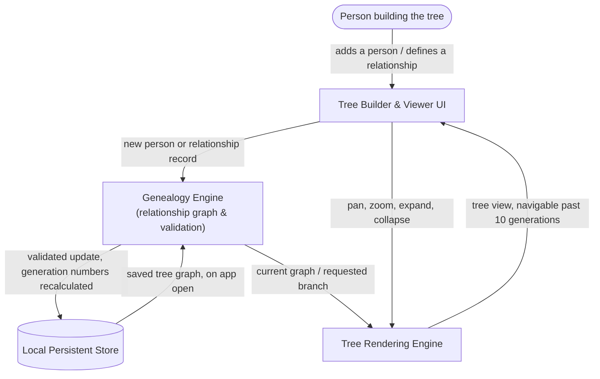

# Family Tree App — System Architecture

## The Idea

> Build an app that can be used to create a family tree with 10 generations deep at a minimum.

That's the whole brief. Two things in it drive every decision below: **"app...used to create"** means a human sits down and builds the tree by hand, over more than one sitting — so the design has to survive being closed and reopened. And **"10 generations deep at a minimum"** is the one sentence that outranks everything else here: a family tree tool that looks fine with 3 generations and falls apart at 10 hasn't done its job. Two components exist specifically to guarantee that number holds — see below.

Nothing in the paragraph mentions other people, other devices, imported records, or AI. So none of those appear as components. A padded diagram would be a worse answer than this one.

---

## Components

| Component | What it does for this project | Why it exists (the words that required it) |
|---|---|---|
| **Tree Builder & Viewer UI** | The screen where a person adds relatives, fills in names and dates, and looks at the tree they've built so far. | "app...**used to create** a family tree" — a human directly builds and views it, so something has to be the thing they touch. |
| **Genealogy Engine** (relationship graph & validation) | Keeps the actual family structure correct: who is whose parent, child, or spouse, and how many generations separate any two people. Rejects nonsense before it's saved — like someone accidentally being listed as their own ancestor. | "create a family tree" + "**10 generations deep**" — this is the component that structurally guarantees there's no hidden ceiling. It's built as an open-ended chain of relationships, not a form with exactly 10 pre-printed generation slots. If this piece has a limit, nothing downstream can fix it. |
| **Tree Rendering Engine** | Draws the tree on screen so it's actually usable at real depth — lets someone pan around, zoom out, and collapse branches they don't need to see right now, instead of 10 generations turning into an unreadable wall of boxes. | "**10 generations deep**" — this is the other half of the guarantee. The Genealogy Engine proves the depth *can exist*; this component proves a person can actually *see and use* it once it does. |
| **Local Persistent Store** | Saves the tree to the device so it's still there the next time the app is opened — nobody wants to rebuild ten generations from scratch. | "**create** a family tree" implies ongoing work across more than one sitting — state that outlives a single session needs somewhere to live. |

Four components. No login system, no server, no external data source, and no AI layer appear here, because the idea doesn't ask for shared access, imported records, or anything that requires generating, extracting, or ranking information by meaning — see [Assumptions](#assumptions) for what would change that.

---

## How It Fits Together

**Plain English:** a person's actions flow through the UI into the Genealogy Engine, which is the only component allowed to decide the family structure is valid — it then hands the confirmed structure to storage (so it survives closing the app) and to the renderer (so it can actually be seen and navigated, even ten generations deep).

---

## Data Flow

1. The app opens; the **UI** asks the **Local Persistent Store** whether a tree already exists on this device.
2. If one does, the **Store** hands the saved graph to the **Genealogy Engine**, which loads it into memory.
3. The person adds someone new, or links two existing people as parent/child or spouses, through the **UI**.
4. The **UI** passes that record to the **Genealogy Engine**, which checks it's structurally sound — no loops, no duplicate people — and recalculates each affected person's generation number.
5. The **Genealogy Engine** writes the validated change to the **Local Persistent Store**, so it survives closing the app.
6. The **Tree Rendering Engine** asks the **Genealogy Engine** for the current graph — or just the branch currently in view — and lays it out so every generation, including the 10th and beyond, stays reachable rather than overflowing one screen.
7. The person pans, zooms, or expands/collapses a branch; the **Rendering Engine** re-queries only the relevant slice each time, so the app doesn't slow down as the tree gets deeper.

---

## Build Order

| Phase | Focus | What it proves |
|---|---|---|
| **1. Genealogy Engine + Local Store** | The relationship graph and its persistence, with no hardcoded generation limit. | The data underneath can actually hold 10+ generations and survive an app restart — before any screen exists to look at it. |
| **2. Tree Builder UI** | Forms and controls to add people and define parent/child/spouse relationships. | Someone with no technical background can build a tree by hand, not just by loading test data. |
| **3. Tree Rendering Engine at depth** *(make-or-break)* | Layout, pan, zoom, and collapse for a real 10+ generation tree. | The one requirement named in the idea actually holds up on screen, not just in storage. This is the phase most likely to fail quietly if skipped or rushed. |
| **4. Validation & edge cases** | The Genealogy Engine catching bad input — cycles, duplicate people, orphaned branches — before it corrupts hours of someone's work. | The app is safe to keep using, not just usable once. |

---

## Assumptions

| Assumption | Impact if wrong |
|---|---|
| Single person, single device — no login, no sharing, no sync. | If a family needs to co-edit one shared tree, this requires adding a backend, authentication, and a shared cloud database — a materially different system than the one above. |
| "10 generations deep at a minimum" means **no fixed ceiling**, not "exactly 10 and no more." | If the real requirement is "cap at 10," the Genealogy Engine could be simpler — a fixed-size structure instead of an open-ended graph. |
| "Family tree" includes spouses, not just a straight ancestor line. | If only direct lineage matters (no marriages), the relationship model simplifies to a single parent-child chain. |
| "App" means a browser-based app, since the idea doesn't name a platform. | If a native desktop or mobile app is intended instead, the UI and rendering technology change, but the Genealogy Engine and data model stay the same. |

---

## What This Design Does Not Cover

Being honest about the edges:

- **No multi-user collaboration.** One person, one tree, one device.
- **No GEDCOM import/export** — the standard file format genealogy software uses to exchange trees isn't mentioned in the idea, so it isn't built.
- **No matching against external historical records** (census data, archives, other genealogy sites).
- **No concurrent-edit conflict resolution** — a direct consequence of the single-user assumption above.
- **No mobile-native offline sync strategy** beyond the device's own local storage.

**The one question that would most change this design:** *does more than one family member need to see or edit this tree?* If the answer is ever yes, the architecture above needs a backend, authentication, and cloud storage added — it stops being a purely local app. The knowledge base's Assumptions page illustrates both branches.
